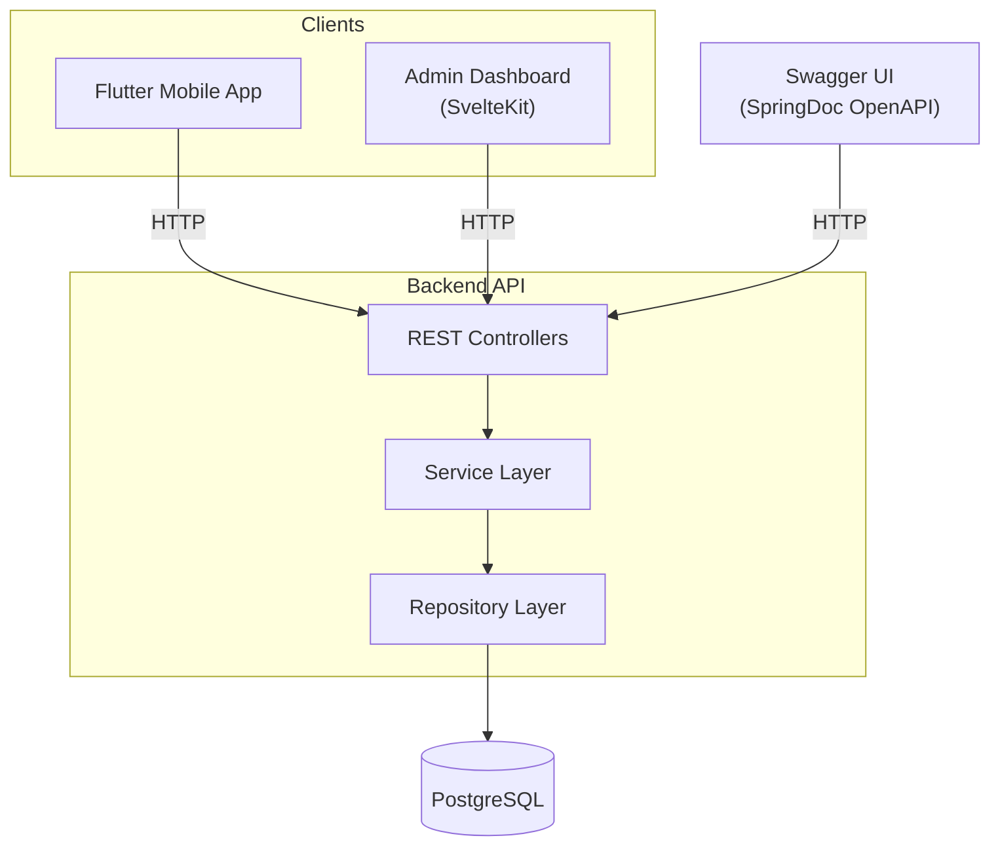
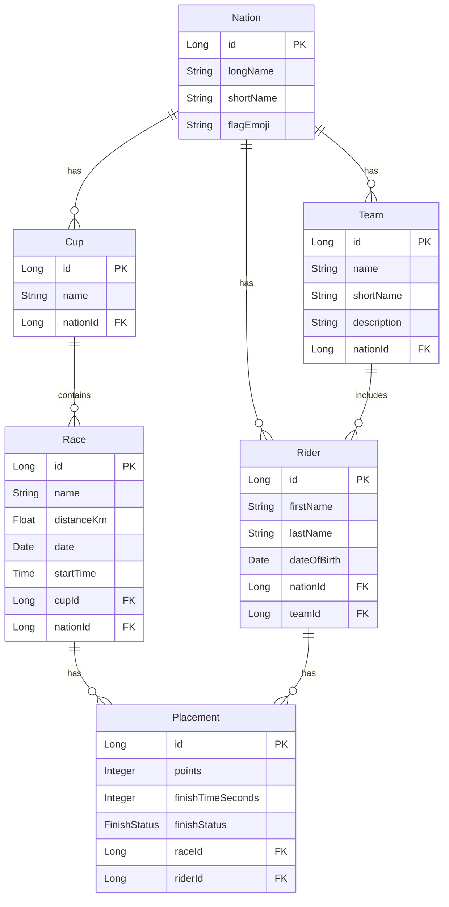
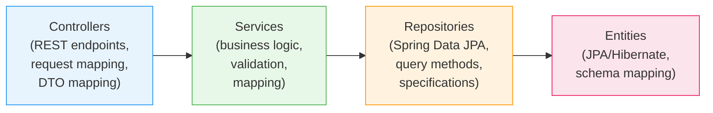

# OneBike

**Disclaimer**: This project is in active development and information in this readme might be outdated. I will do my best to always keep it up-to-date.

A competitive cycling management system for organizing nations, teams, riders, cups, races, and race placements. Built as a monorepo with three components: a Spring Boot backend API, a Flutter mobile client, and a SvelteKit admin dashboard.

## Overview

OneBike is designed for race organizers, team managers, and fans who need a central place to manage and view competitive cycling data. The system models the full lifecycle of a cycling competition:

- **Nations** are the top-level entity — each nation has a name, code, and flag, and owns all of its riders, teams, cups, and races.
- **Teams** group riders together under a nation.
- **Riders** are individual cyclists who belong to a nation and optionally a team.
- **Cups** represent a racing series (e.g., "Lausitzcup 2026") linked to a nation, containing multiple races.
- **Races** are individual events within a cup, with a distance, date, and start time.
- **Placements** record a rider's result in a race — their finish time, points, and finish status.

## Architecture

### System Architecture



The **Flutter mobile app** provides a consumer-facing interface for browsing teams, riders, and races. The **admin dashboard** is a web-based tool for managing all entities (CRUD operations). Both communicate with the backend over HTTP. The **Swagger UI** is automatically generated from the API spec and available at runtime for interactive API exploration.

### Domain Model



### Backend Layered Architecture



Each domain module (`nation`, `team`, `rider`, `cup`, `race`, `placement`) follows this consistent layered pattern:

- **Controllers** handle HTTP requests, input validation, and DTO conversion.
- **Services** contain business logic and orchestrate operations across repositories.
- **Repositories** extend Spring Data JPA and use specifications for dynamic queries.
- **Entities** map directly to the database schema via JPA annotations.

The backend also includes shared utilities for error handling (`GlobalExceptionHandler`), custom validators (e.g., `@ValidUrl`), and sort/filter support.

## Tech Stack

| Layer | Technology | Version |
|---|---|---|
| **Backend** | Kotlin + Spring Boot | 4.1.0 |
| **ORM** | Spring Data JPA (Hibernate) | via Spring Boot |
| **Database** | PostgreSQL | via Docker Compose |
| **API Docs** | SpringDoc OpenAPI (Swagger UI) | 2.8.13 |
| **Build (backend)** | Gradle (Kotlin DSL) | 9.5.1 |
| **Mobile App** | Flutter (Dart) | SDK ^3.12.2 |
| **Admin Dashboard** | SvelteKit + Svelte 5 | 2.63.0 / 5.56.1 |
| **Admin Styling** | Tailwind CSS | 4.3.0 |
| **Admin Build** | Vite | 8.0.16 |
| **Runtime** | Java 21 | |

## Prerequisites

- **Java 21** — required to build and run the backend
- **Docker** — required to run the PostgreSQL database
- **Flutter SDK** (3.12.2+) — required to build and run the mobile app
- **Node.js** (v18+) and npm — required for the admin dashboard

## Getting Started

### 1. Backend Server

Spring Boot application with PostgreSQL. The database is provided via Docker Compose.

```bash
# Start PostgreSQL
cd server
docker compose up -d

# Build and run the server
./gradlew bootRun
```

The server starts at `http://localhost:8080`. Swagger UI is available at `http://localhost:8080/swagger-ui/index.html`.

> **Note:** The development database uses `ddl-auto: create-drop`, meaning the schema and all data are recreated on every server restart.

### 2. Flutter Mobile App

```bash
cd app
flutter pub get
flutter run
```

The app currently targets Android, iOS, Linux, and Web. But is currently not developed until the admin dashboard is ready.

### 3. Admin Dashboard

```bash
cd admin_dashboard
npm install
npm run dev
```

The dashboard starts at `http://localhost:5173`. It connects to the backend API at `http://localhost:8080` by default (configurable via environment variables — see [Environment Variables](#environment-variables)).

**Available scripts:**

| Command | Description |
|---|---|
| `npm run dev` | Start development server |
| `npm run build` | Production build (static site) |
| `npm run preview` | Preview production build |
| `npm run check` | TypeScript type checking |
| `npm run lint` | Check code formatting (Prettier) |
| `npm run format` | Auto-format code |
| `npm run test` | Run unit tests (single run) |
| `npm run test:unit` | Run unit tests (watch mode) |

## Project Structure

```
onebike/
├── server/                        # Spring Boot backend (Kotlin)
│   ├── docker-compose.yml         # PostgreSQL container setup
│   ├── build.gradle.kts           # Gradle build config
│   └── src/
│       ├── main/kotlin/com/xpromus/onebike_backend/
│       │   ├── nation/            # Nation entity, controller, service, repo, DTOs
│       │   ├── team/              # Team entity, controller, service, repo, DTOs
│       │   ├── rider/             # Rider entity, controller, service, repo, DTOs
│       │   ├── cup/               # Cup entity, controller, service, repo, DTOs
│       │   ├── race/              # Race entity, controller, service, repo, DTOs
│       │   ├── placement/         # Placement entity, controller, service, repo, DTOs
│       │   ├── error/             # Global exception handling, error DTOs, validators
│       │   └── util/              # Shared utilities (sort direction, etc.)
│       └── main/resources/
│           └── application.yaml   # Spring Boot configuration
│
├── app/                           # Flutter mobile client
│   ├── lib/
│   │   ├── main.dart              # App entry point
│   │   ├── pages/                 # UI pages (home, search, user, team, rider)
│   │   ├── api/                   # HTTP API clients
│   │   ├── types/                 # Dart type definitions
│   │   └── components/            # Reusable UI components
│   └── pubspec.yaml               # Dart dependencies
│
└── admin_dashboard/               # SvelteKit admin dashboard
    ├── src/
    │   ├── routes/                # SvelteKit routes (nations, teams, riders, races, cups)
    │   └── lib/
    │       ├── components/        # Svelte components
    │       ├── types/             # TypeScript types (server + client)
    │       ├── server/api/        # Server-side API helpers
    │       ├── middleware/         # Data mappers
    │       └── config/            # API configuration
    ├── .env.example               # Environment variable template
    └── package.json               # npm dependencies and scripts
```

## API Documentation

The backend exposes a REST API documented via SpringDoc OpenAPI. Once the server is running, visit the Swagger UI at:

```
http://localhost:8080/swagger-ui/index.html
```

### Endpoint Overview

| Resource | Base Path | Notes |
|---|---|---|
| Nations | `/api/v1/nations` | Versioned, supports filtering and sorting |
| Cups | `/api/v1/cups` | Versioned, supports filtering and sorting |
| Riders | `/riders` | Supports `/full` for nested children |
| Teams | `/teams` | Supports `/full` for nested children |
| Races | `/races` | — |
| Placements | `/placements` | — |

> Some endpoints support query parameters for filtering and sorting. See the Swagger UI for full details.

## Environment Variables

### Admin Dashboard

Configured via `.env` in the `admin_dashboard/` directory (see `.env.example`):

| Variable | Default | Description |
|---|---|---|
| `API_BASE_URL` | `http://localhost:8080` | Backend API base URL |
| `NATIONS_PATH` | `/nations` | Nations endpoint path |
| `RIDERS_PATH` | `/riders` | Riders endpoint path |
| `TEAMS_PATH` | `/teams` | Teams endpoint path |

### Backend Server

Configured in `server/src/main/resources/application.yaml`:

| Setting | Default | Description |
|---|---|---|
| `spring.datasource.url` | `jdbc:postgresql://localhost:5432/onebike_db` | Database connection URL |
| `spring.datasource.username` | `onebike` | Database username |
| `spring.datasource.password` | `onebike` | Database password |
| `spring.jpa.hibernate.ddl-auto` | `create-drop` | Schema management strategy |

## Testing

> **Note:** Tests are currently a work in progress. Some test files may not compile or may contain placeholder implementations.

Test commands are available for all three components:

```bash
# Backend
cd server && ./gradlew test

# Admin Dashboard
cd admin_dashboard && npm run test

# Flutter App (widget tests)
cd app && flutter test
```
